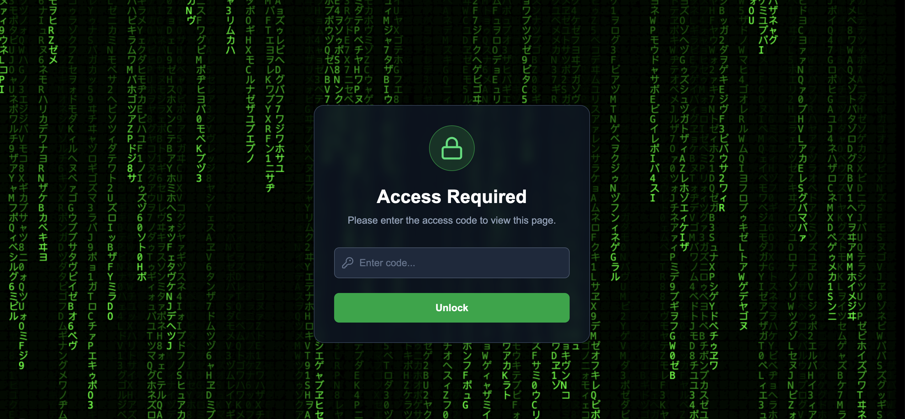

React Simple Gatereact-simple-gate is a small, flexible React component library for protecting pages or components behind an access code-- obviously, not very secure.




## Wrap Your Protected Routes
In your Next.js app, wrap your protected routes using a Route Group layout.

```
'use client';

// Import the provider
import { AccessCodeProvider } from 'react-simple-gate';

// Import the CSS file ONE TIME
import 'react-simple-gate/style.css';

export default function ProtectedLayout({
  children,
}: {
  children: React.ReactNode;
}) {
  return (
    // Wrap your layout
    <AccessCodeProvider
      accessCode={process.env.NEXT_PUBLIC_ACCESS_CODE!}
      expirationHours={8}
    >
      {children}
    </AccessCodeProvider>
  );
}
```

## Protect Your Page
On your protected page, use the useAccessCode hook to get the user's auth state and show the login form or the page content.
```
// app/(protected)/dashboard/page.tsx

'use client';

import {
  useAccessCode,
  AccessCodeLoginForm,
  MatrixRain, // Import a background
} from 'react-simple-gate';

// A simple loading spinner
const LoadingSpinner = () => (
  <div className="flex items-center justify-center min-h-screen bg-black">
    <div className="animate-spin rounded-full h-16 w-16 border-t-2 border-b-2 border-green-500"></div>
  </div>
);

export default function DashboardPage() {
  const { isAuthorized, isLoading } = useAccessCode();

  if (isLoading) {
    return <LoadingSpinner />;
  }

  if (!isAuthorized) {
    // Show the login form
    return <AccessCodeLoginForm background={<MatrixRain />} />;
  }

  // User is authorized, show the app
  return (
    <main>
      <h1>Protected Dashboard</h1>
      <p>You can only see this if you are logged in.</p>
    </main>
  );
}
```

### Customizing the Login Form
You can easily customize the text and styles of the AccessCodeLoginForm:
```
<AccessCodeLoginForm
  background={<Starfield />}
  title="Project Locked"
  subtitle="Enter the code to continue."
  buttonText="Authorize"
  buttonClassName="bg-blue-600 hover:bg-blue-700"
  titleClassName="text-blue-300"
/>
Using the Simple <Gate>For simple conditional rendering inside your components:import { Gate } from 'react-simple-gate';

function MyComponent({ user }) {
  return (
    <div>
      <h1>Welcome, {user.name}</h1>
      <Gate isAllowed={user.isAdmin}>
        <button>Admin Panel</button>
      </Gate>
    </div>
  );
}
```


